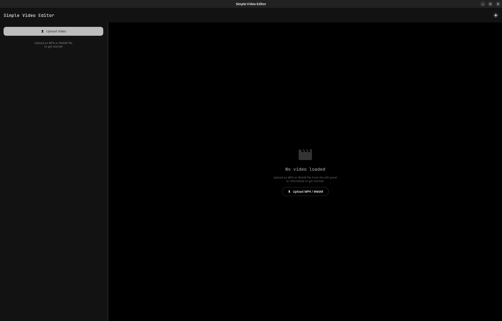
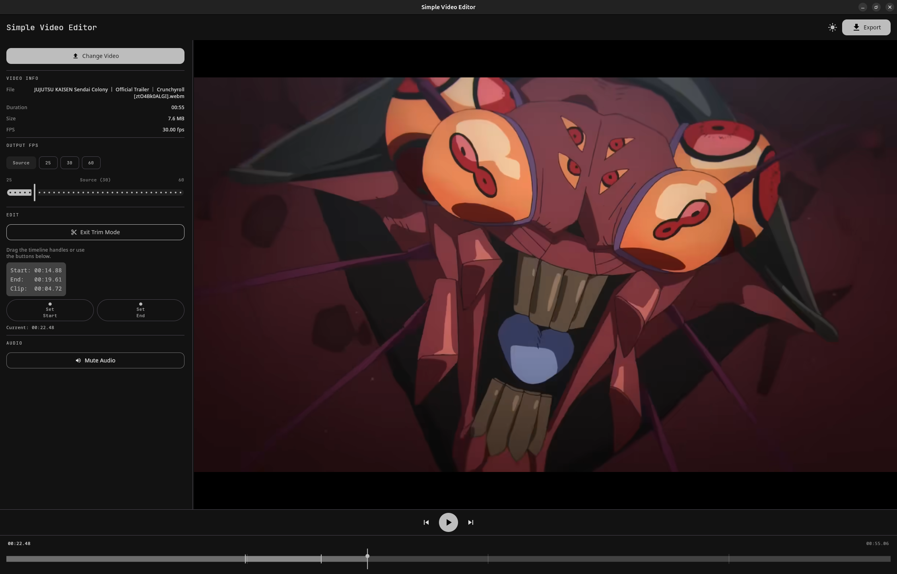

# SimpleVideoEditor

A lightweight, modern desktop video editor built with **Kotlin** and **Compose Multiplatform**. It provides a simple interface for trimming videos and adjusting frame rates, powered by **FFmpeg**.

[](https://kotlinlang.org) 
[](https://www.jetbrains.com/lp/compose-multiplatform/)
[](https://m3.material.io/)

[](https://buymeacoffee.com/zahidkh)

---

## 📸 Screenshots

|              Empty State              |    Editor with Trim Mode     |
|:-------------------------------------:|:----------------------------:|
|  |  |

## 🎬 Demo

<video src="https://github.com/user-attachments/assets/9e7c5b9e-a0da-40e1-982e-ed15098543fc" width="640" controls></video>

<video src="https://github.com/user-attachments/assets/76c294dd-4406-470a-ab8a-346115008c1e" width="640" controls></video>

---

## 🚀 Features

- **🎬 Video Trimming:** Easily set start and end points using a visual timeline or precise buttons.
- **⚡ FPS Control:** Change the target frame rate (FPS) for your exported video clips.
- **📊 Metadata Extraction:** Automatically see video duration, current frame rate, and other details upon loading.
- **📽️ Real-time Preview:** Native Compose rendering for video frames, enabling seamless overlays and smooth scrubbing.
- **🖼️ Image & Text Overlays:** Add multiple image and text tracks with customizable duration, position, and scaling.
- **🔡 Multi-line Text Support:** Advanced text rendering with wrapping and font synchronization between preview and export.
- **🎨 Modern UI:** Sleek Material 3 design with a draggable timeline area and full **Dark Mode** support.
- **🎞️ Precise Clipping:** Drag and resize clips directly on the timeline with sub-millisecond precision.
- **⚙️ Advanced Export:** Powered by FFmpeg with complex filter chains for high-quality video generation including all overlays.
- **📦 Multi-platform:** Native distributions for Windows (.msi, .exe) and Linux (.deb).

---

## 🏗️ Tech Stack

- **UI Framework:** [Compose Multiplatform](https://www.jetbrains.com/lp/compose-multiplatform/) (Desktop)
- **Dependency Injection:** [Koin](https://insert-koin.io/)
- **Video Playback:** [vlcj](https://github.com/caprica/vlcj) (VLC binding with custom frame capture)
- **Video Processing:** [FFmpeg](https://ffmpeg.org/) (via CLI with complex filter mapping)
- **Graphics Engine:** [Skia](https://skia.org/) (via Compose) for WebP and image decoding fallback
- **State Management:** Kotlin Coroutines & Flow
- **Components:** [Deskit](https://github.com/zahid4kh/deskit) (Material 3 Dialogs & File Choosers)

---

## 💡 Implementation Details

A significant architectural shift in this version is the transition from displaying video in a heavy Swing `EmbeddedMediaPlayerComponent` to a custom `CallbackMediaPlayerComponent`. 

- **Frame Capture:** Video frames are captured from VLC into memory as `BufferedImage`.
- **Compose Integration:** These frames are then converted to `ImageBitmap` and rendered using the standard Compose `Image` composable.
- **Overlays:** This enables us to use native Compose `Box` and `Text` components for overlays, ensuring they scale and move perfectly with the video frame.
- **Consistency:** The same coordinate system is shared between the preview and the FFmpeg export process.

---

## 🛠️ Prerequisites

To run or build this application, ensure you have the following installed on your system:

### For Users (Running the App)
1.  **[VLC Media Player](https://www.videolan.org/vlc/):** Required for video playback (uses `vlcj`).
2.  **[FFmpeg](https://ffmpeg.org/download.html):** Must be installed and available in your system's `PATH`. The app uses `ffmpeg` for trimming and `ffprobe` for metadata extraction.

### For Developers
- **JDK 17** or later.
- **IntelliJ IDEA** (Recommended).

---

## 📥 Installation & Download

### Windows
1.  Download the `.msi` or `.exe` from the [Releases](https://github.com/zahid4kh/simplevideoeditor/releases) page.
2.  Run the installer and follow the instructions.
3.  **Note:** Ensure VLC and FFmpeg are installed on your system.

### Linux (Debian/Ubuntu)
1.  Download the `.deb` package.
2.  Install it using:

```bash
sudo dpkg -i simplevideoeditor.deb
```

---

## 💻 Development

### Clone the Repository
```bash
git clone https://github.com/zahid4kh/simplevideoeditor.git
cd simplevideoeditor
```

### Make Gradle Wrapper Executable (Linux/macOS)
```bash
chmod +x gradlew
```

### Running the Application
```bash
./gradlew run
```

### Hot Reload (Recommended for Development)
```bash
./gradlew :hotRun --mainClass SimpleVideoEditor --auto
```

### Building Distributions

| Platform | Command | Output Format |
| :--- | :--- | :--- |
| **Current OS** | `./gradlew packageDistributionForCurrentOS` | Native Installer |
| **Windows** | `./gradlew packageMsi` / `packageExe` | .msi / .exe |
| **macOS** | `./gradlew packageDmg` | .dmg |
| **Linux** | `./gradlew packageDeb` | .deb |

*For Linux users, a custom task is available to fix the Taskbar icon:*
```bash
./gradlew packageDebWithWMClass
```

---

## 🤝 Contributing

Contributions are welcome! Feel free to open issues or submit pull requests.

## 📄 License

This project is licensed under the Apache License 2.0 - see the [LICENSE](LICENSE) file for details.

---
*Generated with [Compose for Desktop Wizard](https://github.com/zahid4kh/compose-for-desktop/tree/desktop).*